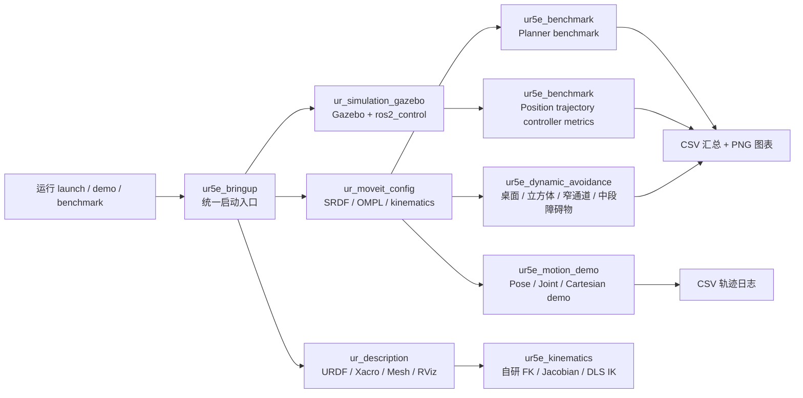
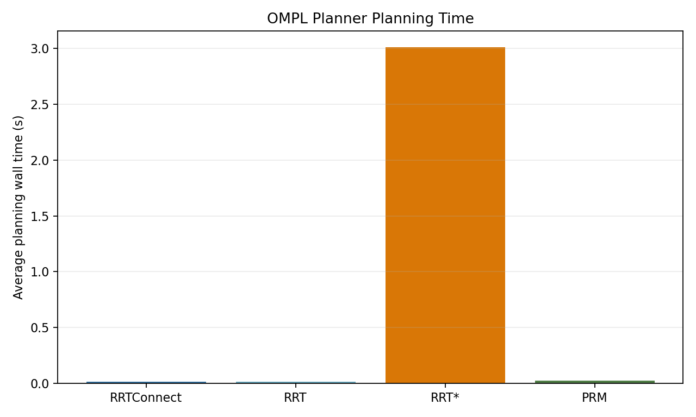
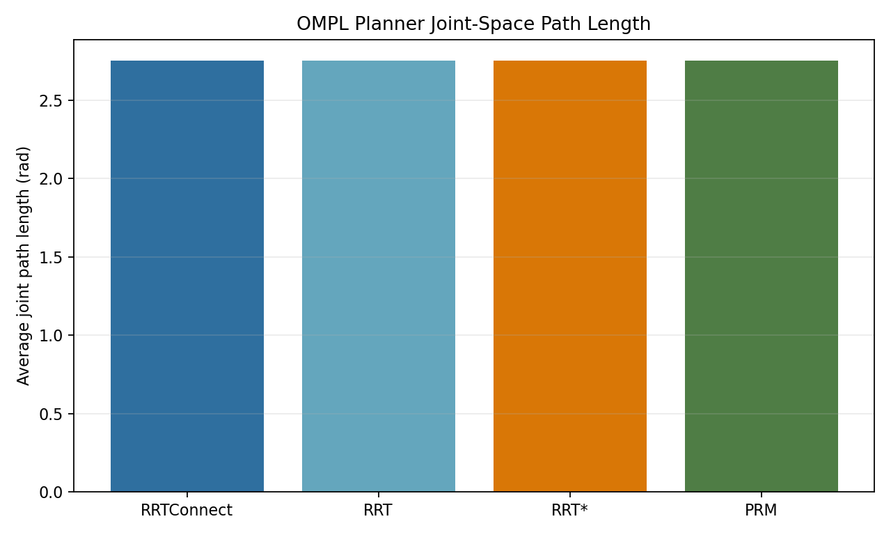
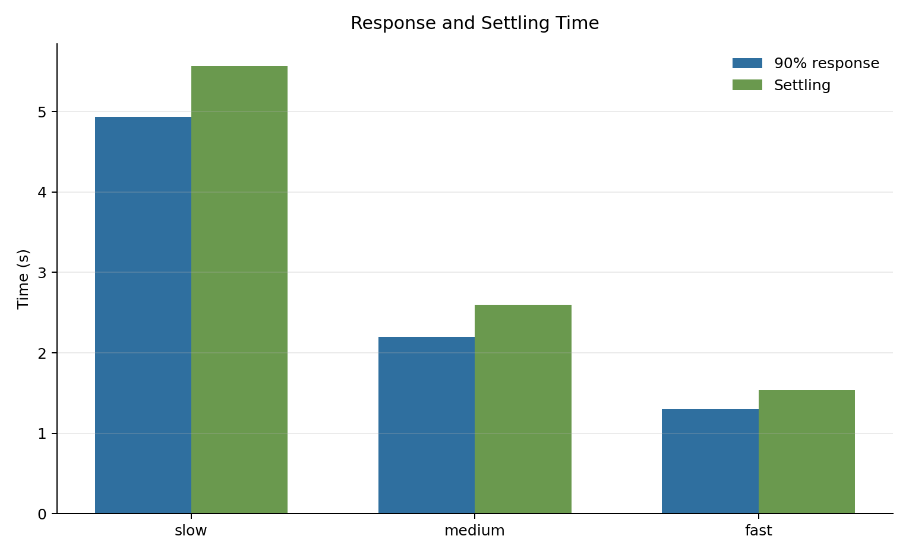
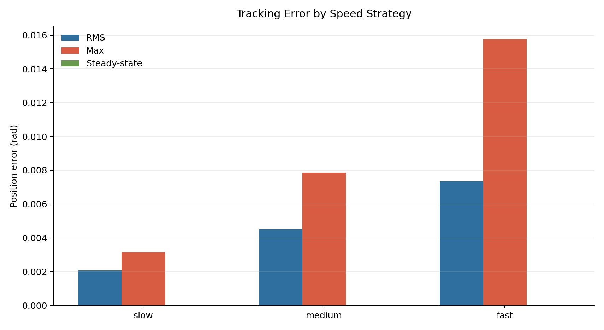
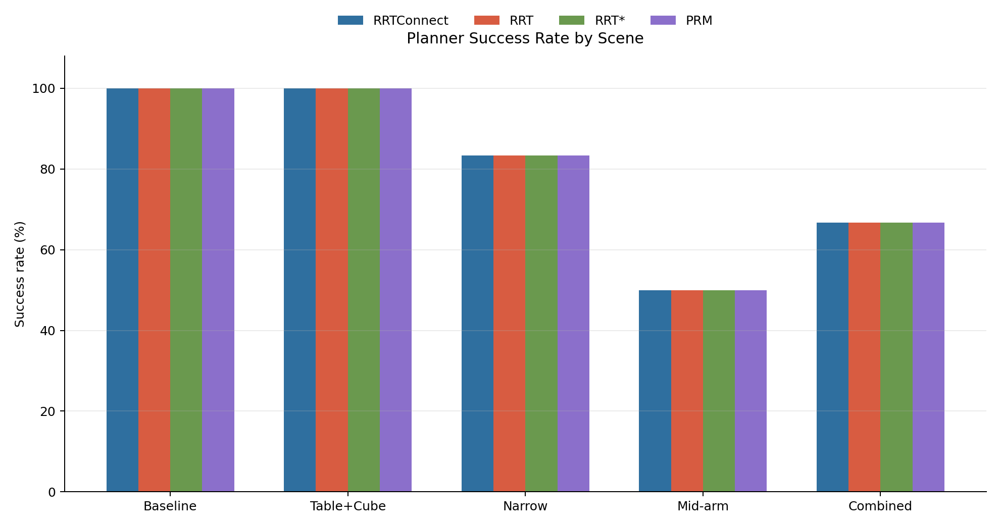
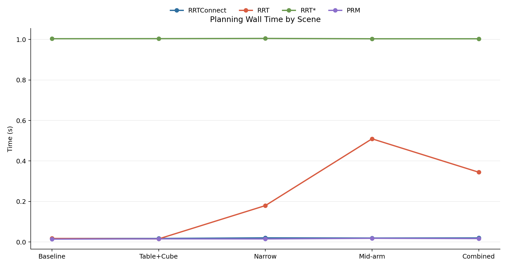
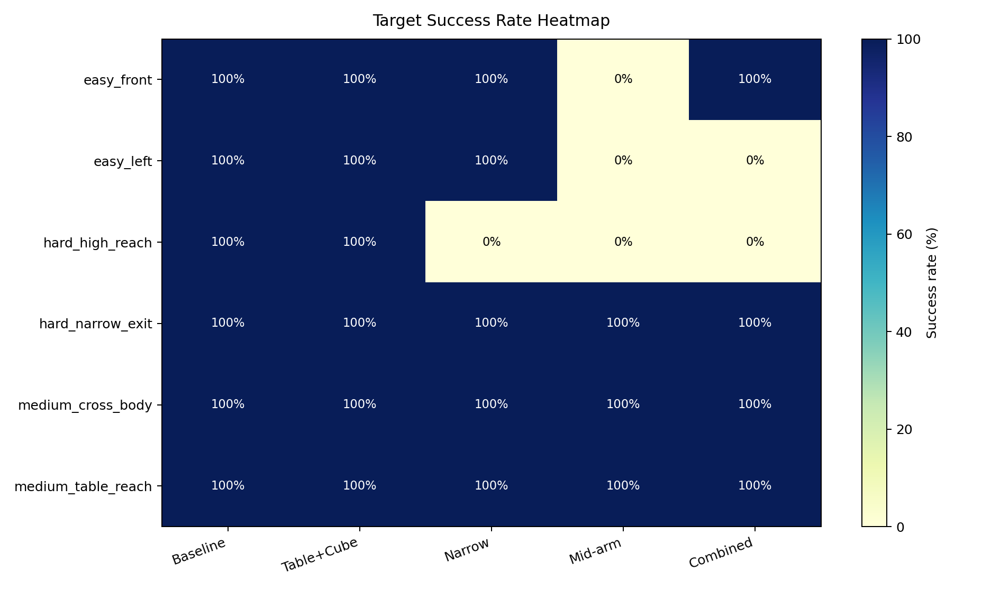

# 基于ROS2+moveit2+ros_control的UR5e六轴机械臂运动规划、轨迹跟踪与避障仿真项目

这是一个面向机器人运动控制实习准备的 ROS 2 Humble 项目，围绕 UR5e 六轴机械臂完成从模型、Gazebo 仿真、MoveIt 规划、轨迹跟踪记录，到 planner/controller benchmark 和结构化避障评估的一套闭环 demo。

项目重点：

- 搭建 URDF/Xacro、ros2_control、Gazebo 和 MoveIt 的完整仿真链路。
- 让 UR5e 完成关节目标、末端位姿目标和笛卡尔路径规划。
- 记录轨迹执行过程，并用 CSV 和图表分析跟踪误差。
- 比较不同 OMPL planner 在多目标、多障碍场景下的成功率、规划时间和路径长度。
- 增强现有 position trajectory controller 的评价指标，包括超调、稳态误差、90% 响应时间和调节时间。
- 建桌面、立方体障碍物、目标物、近距离障碍物等避障场景。
- 自主实现与当前 URDF 坐标链一致的 UR5e 正运动学、几何雅可比和阻尼最小二乘逆运动学，并通过有限差分及 KDL 随机位形对照验证。

## 我解决了什么问题

这个项目解决的是“机械臂运动规划 demo 很容易停留在演示层，但很难证明规划和控制效果”的问题。

我把 UR5e 的仿真、规划、控制和数据分析连成一条可复现实验链路：先用 Gazebo 和 MoveIt 验证机械臂基础运动，再通过轨迹记录器输出实际执行数据，最后用 benchmark 脚本把不同 planner、不同目标难度和不同控制速度策略量化成 CSV、汇总表和图表。不仅展示机械臂避障规划过程，也能回答“哪个规划器更稳”“速度变快后误差如何变化”“窄通道和中段障碍物对成功率有什么影响”等更接近工程的问题。

## 系统架构



## 功能包说明

- `ur_description`：UR5e 机器人模型、mesh、URDF/Xacro 和 RViz 模型查看配置。
- `ur_moveit_config`：UR5e MoveIt 配置，包括 manipulator 规划组、运动学和 OMPL planner 配置。
- `ur_simulation_gazebo`：Gazebo 仿真启动、ros2_control 控制器配置和仿真环境。
- `ur5e_motion_demo`：位姿目标、关节目标、笛卡尔路径 demo，轨迹记录和误差绘图脚本。
- `ur5e_benchmark`：planner benchmark、position trajectory controller 指标增强、CSV 汇总和可视化脚本。
- `ur5e_dynamic_avoidance`：结构化避障场景、目标难度分组、避障 planner benchmark 和展示图表。
- `ur5e_bringup`：统一 launch 入口，便于启动模型查看、仿真、MoveIt、demo 和 benchmark。
- `ur5e_kinematics`：不依赖 MoveIt 求解的 C++ 运动学核心库，实现 FK、6×6 几何雅可比、SO(3) 位姿误差和带奇异阻尼/关节限位的数值 IK，并以有限差分与 KDL 作为独立测试基准。
  详细推导和面试讲解见 [`docs/kinematics_interview_guide.md`](docs/kinematics_interview_guide.md)。

## 环境依赖

项目基于 ROS 2 Humble 开发。检查依赖：

```bash
rosdep check --from-paths src --ignore-src
```

如果是全新环境，缺少系统包时可安装：

```bash
sudo apt install liburdfdom-tools ros-humble-warehouse-ros-sqlite
```

## 编译

```bash
source /opt/ros/humble/setup.bash
colcon build
source install/setup.bash
```

## Demo 运行

查看 UR5e 模型：

```bash
ros2 launch ur5e_bringup view_model.launch.py
```

启动 Gazebo 仿真：

```bash
ros2 launch ur5e_bringup simulation.launch.py
```

启动 Gazebo + MoveIt：

```bash
ros2 launch ur5e_bringup planning_sim.launch.py
```

运行末端位姿目标规划 demo：

```bash
ros2 launch ur5e_bringup demo_pose_goal.launch.py
```

运行关节空间目标 demo：

```bash
ros2 launch ur5e_bringup demo_joint_goal.launch.py
```

运行笛卡尔路径点 demo：

```bash
ros2 launch ur5e_bringup demo_cartesian_waypoints.launch.py
```

运行笛卡尔路径点规划，并记录轨迹跟踪 CSV：

```bash
ros2 launch ur5e_bringup demo_cartesian_tracking.launch.py output_file:=/tmp/ur5e_trajectory_log.csv
```

生成轨迹跟踪误差图：

```bash
ros2 run ur5e_motion_demo plot_trajectory_log.py /tmp/ur5e_trajectory_log.csv --output /tmp/ur5e_tracking_error.png
```

运行桌面、立方体障碍物、目标物、窄通道和机械臂中段障碍物避障 demo：

```bash
ros2 launch ur5e_dynamic_avoidance obstacle_avoidance_demo.launch.py gazebo_gui:=false
```

无 Gazebo GUI 运行规划仿真：

```bash
ros2 launch ur5e_bringup planning_sim.launch.py gazebo_gui:=false
```

## Benchmark 运行

运行自研运动学随机可达位姿 benchmark：

```bash
ros2 run ur5e_kinematics kinematics_benchmark 1000
```

该测试从随机关节状态生成可达目标位姿，对初值加入扰动后求解 IK，输出成功率、成功样本位姿残差、平均迭代次数和单次求解耗时。数值 IK 是局部求解器，结果不代表全局完备性。

比较 RRTConnect、RRT、RRT* 和 PRM 在多个关节空间目标上的表现：

```bash
ros2 launch ur5e_bringup benchmark_planners.launch.py trials:=5 output_file:=/tmp/ur5e_planner_benchmark.csv
```

比较现有 position `joint_trajectory_controller` 在不同速度/加速度缩放策略下的执行表现：

```bash
ros2 launch ur5e_bringup benchmark_control_strategies.launch.py trials:=3 output_file:=/tmp/ur5e_control_strategy_benchmark.csv
```

控制器 benchmark 当前输出：

- 规划时长和实测执行时长。
- RMS 跟踪误差、最大绝对误差、最终误差。
- 稳态最大误差和稳态平均误差。
- 最大超调和超调百分比。
- 90% 响应时间。
- 调节时间。

响应指标默认参数：

```bash
response_ratio:=0.90
settling_tolerance:=0.01
```

运行结构化避障 planner benchmark：

```bash
ros2 launch ur5e_dynamic_avoidance obstacle_planner_benchmark.launch.py \
  gazebo_gui:=false trials:=1 planning_time:=1.0 \
  output_file:=/tmp/ur5e_obstacle_planner_benchmark.csv
```

按场景和目标难度筛选：

```bash
ros2 launch ur5e_dynamic_avoidance obstacle_planner_benchmark.launch.py \
  scenarios:=narrow_passage,combined_hard target_difficulties:=hard
```

汇总 planner 和 controller benchmark：

```bash
ros2 run ur5e_benchmark summarize_benchmarks.py \
  --planner-csv /tmp/ur5e_planner_benchmark.csv \
  --control-csv /tmp/ur5e_control_strategy_benchmark.csv
```

生成 controller benchmark 图表：

```bash
ros2 run ur5e_benchmark plot_control_benchmark.py \
  --summary-csv src/ur5e_benchmark/results/control_strategy_comparison/control_strategy_summary.csv \
  --raw-csv src/ur5e_benchmark/results/control_strategy_comparison/control_strategy_benchmark.csv \
  --output-dir src/ur5e_benchmark/results/control_strategy_comparison
```

汇总结构化避障 benchmark：

```bash
ros2 run ur5e_dynamic_avoidance summarize_dynamic_benchmark.py \
  /tmp/ur5e_obstacle_planner_benchmark.csv \
  --planner-summary /tmp/ur5e_obstacle_planner_summary.csv \
  --target-summary /tmp/ur5e_obstacle_target_summary.csv \
  --difficulty-summary /tmp/ur5e_obstacle_difficulty_summary.csv
```

生成结构化避障 benchmark 展示图：

```bash
ros2 run ur5e_dynamic_avoidance plot_obstacle_benchmark.py \
  --planner-summary src/ur5e_dynamic_avoidance/results/obstacle_benchmark/obstacle_planner_summary.csv \
  --target-summary src/ur5e_dynamic_avoidance/results/obstacle_benchmark/obstacle_target_summary.csv \
  --difficulty-summary src/ur5e_dynamic_avoidance/results/obstacle_benchmark/obstacle_difficulty_summary.csv \
  --output-dir src/ur5e_dynamic_avoidance/results/obstacle_benchmark/plots
```

## 结果展示

### 笛卡尔轨迹跟踪

| 内容 | 文件 |
| --- | --- |
| 轨迹日志 | `src/ur5e_motion_demo/results/cartesian_tracking/trajectory_log.csv` |
| 轨迹误差图 | `src/ur5e_motion_demo/results/cartesian_tracking/tracking_error.png` |
| 各关节 RMS 误差 | `src/ur5e_motion_demo/results/cartesian_tracking/tracking_rms_by_joint.png` |
| 结果说明 | `src/ur5e_motion_demo/results/cartesian_tracking/README.md` |


### Planner Benchmark

| 图表 | 文件 |
| --- | --- |
| planner 平均规划时间 | `src/ur5e_benchmark/results/planner_comparison/planner_planning_time.png` |
| planner 平均路径长度 | `src/ur5e_benchmark/results/planner_comparison/planner_path_length.png` |
| 不同目标规划时间 | `src/ur5e_benchmark/results/planner_comparison/planner_target_planning_time.png` |
| 原始 CSV | `src/ur5e_benchmark/results/planner_comparison/planner_benchmark.csv` |
| 汇总 CSV | `src/ur5e_benchmark/results/planner_comparison/planner_summary.csv` |





### Position Trajectory Controller Benchmark

| 图表 | 文件 |
| --- | --- |
| 规划/实测时长对比 | `src/ur5e_benchmark/results/control_strategy_comparison/control_duration.png` |
| 跟踪误差指标 | `src/ur5e_benchmark/results/control_strategy_comparison/control_tracking_error.png` |
| 响应时间与调节时间 | `src/ur5e_benchmark/results/control_strategy_comparison/control_response_time.png` |
| 超调指标 | `src/ur5e_benchmark/results/control_strategy_comparison/control_overshoot.png` |
| 速度-误差权衡散点图 | `src/ur5e_benchmark/results/control_strategy_comparison/control_speed_error_tradeoff.png` |
| 原始 CSV | `src/ur5e_benchmark/results/control_strategy_comparison/control_strategy_benchmark.csv` |
| 汇总 CSV | `src/ur5e_benchmark/results/control_strategy_comparison/control_strategy_summary.csv` |





当前结果显示：`slow` 策略误差最低但响应最慢，`fast` 策略响应最快但 RMS/最大误差更高，三组策略稳态误差都很小，说明现有 position trajectory controller 在仿真环境下有较稳定的终点收敛能力。

### 结构化避障 Benchmark

场景包含：

- `baseline`：无额外障碍基线场景。
- `table_cube_goal`：桌面、立方体障碍物和目标物。
- `narrow_passage`：窄通道。
- `mid_arm_obstacle`：障碍物靠近机械臂中段。
- `combined_hard`：组合高难度场景。

目标难度分组：

- `easy`
- `medium`
- `hard`

| 图表 | 文件 |
| --- | --- |
| 各场景成功率 | `src/ur5e_dynamic_avoidance/results/obstacle_benchmark/plots/success_rate_by_scene.png` |
| 各场景规划时间 | `src/ur5e_dynamic_avoidance/results/obstacle_benchmark/plots/planning_time_by_scene.png` |
| 各场景关节路径长度 | `src/ur5e_dynamic_avoidance/results/obstacle_benchmark/plots/joint_path_length_by_scene.png` |
| 不同难度成功率 | `src/ur5e_dynamic_avoidance/results/obstacle_benchmark/plots/success_rate_by_difficulty.png` |
| 目标成功率热力图 | `src/ur5e_dynamic_avoidance/results/obstacle_benchmark/plots/target_success_heatmap.png` |
| planner 效率散点图 | `src/ur5e_dynamic_avoidance/results/obstacle_benchmark/plots/planner_efficiency_scatter.png` |
| 原始 CSV | `src/ur5e_dynamic_avoidance/results/obstacle_benchmark/obstacle_planner_benchmark.csv` |







## Demo 素材位

建议将答辩或简历展示素材放在 `docs/media/` 目录，README 中使用固定路径引用，后续替换文件即可。

| 素材 | 建议文件 | 当前状态 |
| --- | --- | --- |
| Demo GIF | `docs/media/ur5e_obstacle_demo.gif` | 待录制 |
| Gazebo 截图 | `docs/media/gazebo_obstacle_scene.png` | 待录制 |
| RViz 截图 | `docs/media/rviz_motion_plan.png` | 待录制 |
| 30-60 秒视频 | 在此处填写 Bilibili / YouTube / 网盘链接 | 待上传 |


## 当前完整度

已完成：

- UR5e 模型查看。
- Gazebo + ros2_control 仿真。
- MoveIt 规划配置。
- 关节目标、末端位姿目标和笛卡尔路径 demo。
- 笛卡尔轨迹记录、CSV 输出和误差可视化。
- OMPL planner benchmark。
- position trajectory controller 指标增强和图表输出。
- 桌面、立方体、目标物、障碍物等结构化避障场景。
- 按场景、目标和难度分组的避障 benchmark。
- CSV 汇总和 PNG 图表展示。


## 测试验证

```bash
source /opt/ros/humble/setup.bash
colcon build
colcon test
colcon test-result --all --verbose
```

当前工作区最近一次验证：

- 编译：`colcon build --packages-select ur5e_benchmark ur5e_bringup` 通过。
- 单元/launch 测试：`77 tests, 0 errors, 0 failures, 9 skipped`。
- 结构化避障 benchmark smoke run：生成 120 条记录。
- position trajectory controller benchmark：输出 CSV、汇总 CSV 和 6 张展示图。
