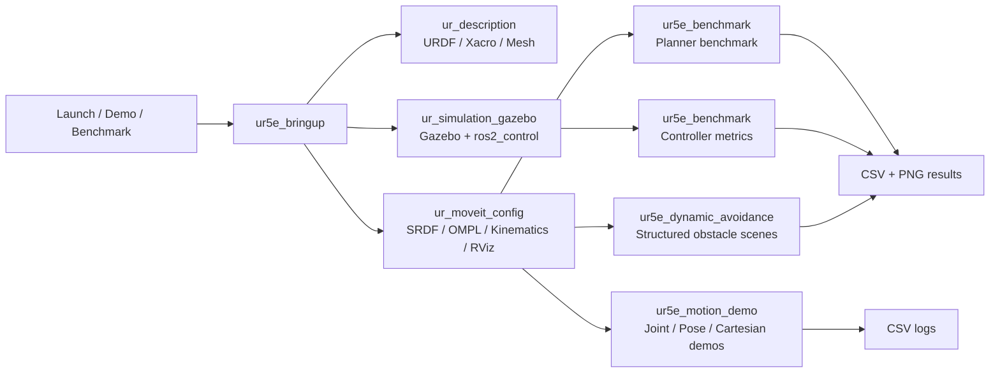

# UR5e Motion Planning, Trajectory Tracking and Obstacle Avoidance Simulation

基于 ROS 2 Humble、MoveIt 2、Gazebo 和 ros2_control 的 UR5e 六轴机械臂项目。项目面向机器人运动控制实习展示，重点覆盖机械臂建模仿真、关节空间规划、末端位姿规划、笛卡尔多路点规划、轨迹跟踪误差分析、planner/controller benchmark 和结构化避障场景。

这个项目不是单一的机械臂演示，而是一条可复现的工程链路：机器人模型和控制器启动后，由 MoveIt 2 生成运动轨迹，Gazebo + ros2_control 执行轨迹，再通过 CSV 和图表分析规划时间、路径长度、执行误差、响应时间、超调和避障成功率。

## Demo Videos

| 场景 | 视频 | 展示重点 |
| --- | --- | --- |
| 关节空间目标规划 | [joint_space.webm](docs/media/joint_space.webm) | MoveIt 关节目标规划、Gazebo 执行、RViz wrist_3_link 末端轨迹 |
| 末端位姿目标规划 | [pose_goal.webm](docs/media/pose_goal.webm) | 末端 pose goal、规划路径和执行效果 |
| 笛卡尔多路点规划 | [cartesian_waypoints.webm](docs/media/cartesian_waypoints.webm) | P1-P5 路点标记、笛卡尔路径、末端轨迹线 |
| 结构化避障规划 | [obstacle_avoidance.webm](docs/media/obstacle_avoidance.webm) | 桌面、障碍物、窄通道、中段障碍物和目标点标记 |

> RViz 中已将整臂 ghost trail 关闭，只保留 `wrist_3_link` 的 Show Trail，视频中看到的是末端运动轨迹而不是整机重影。

## Project Highlights

- 完成 UR5e 的 URDF/Xacro、MoveIt 2、Gazebo 和 ros2_control 仿真集成。
- 实现关节空间目标、末端位姿目标、笛卡尔多路点三类典型规划 demo。
- 针对笛卡尔多路点和避障 demo 增加 RViz MarkerArray 标注，使路点、障碍物和目标更容易观察。
- 通过轨迹日志记录和绘图脚本分析六轴关节跟踪误差。
- 对 RRTConnect、RRT、RRTstar、PRM 等 OMPL planner 做规划时间、成功率和路径长度对比。
- 对 position trajectory controller 在不同速度/加速度缩放策略下的执行效果做 benchmark。
- 构建桌面、立方体障碍物、目标物、窄通道、机械臂中段障碍物等结构化避障场景。

## System Architecture



## Packages

| Package | 作用 |
| --- | --- |
| `ur_description` | UR5e 模型、mesh、URDF/Xacro 和模型查看配置 |
| `ur_moveit_config` | MoveIt 2 配置、OMPL planner、运动学参数、RViz 展示配置 |
| `ur_simulation_gazebo` | Gazebo 仿真环境和 ros2_control 控制器配置 |
| `ur5e_motion_demo` | 关节目标、位姿目标、笛卡尔多路点 demo，以及轨迹记录和绘图 |
| `ur5e_benchmark` | planner benchmark、controller benchmark、CSV 汇总和图表生成 |
| `ur5e_dynamic_avoidance` | 结构化避障 demo、避障 benchmark 和可视化图表 |
| `ur5e_bringup` | 常用启动入口，统一管理 demo 和 benchmark launch |

## Environment

项目基于 ROS 2 Humble。全新环境可先检查依赖：

```bash
cd ~/ur5e_ws
source /opt/ros/humble/setup.bash
rosdep check --from-paths src --ignore-src
```

如缺少常见依赖，可安装：

```bash
sudo apt install liburdfdom-tools ros-humble-warehouse-ros-sqlite
```

## Build

```bash
cd ~/ur5e_ws
source /opt/ros/humble/setup.bash
colcon build
source install/setup.bash
```

## Demo Commands

查看 UR5e 模型：

```bash
ros2 launch ur5e_bringup view_model.launch.py
```

启动 Gazebo 仿真：

```bash
ros2 launch ur5e_bringup simulation.launch.py
```

启动 Gazebo + MoveIt：

```bash
ros2 launch ur5e_bringup planning_sim.launch.py
```

运行末端位姿目标 demo：

```bash
ros2 launch ur5e_bringup demo_pose_goal.launch.py
```

运行关节空间目标 demo：

```bash
ros2 launch ur5e_bringup demo_joint_goal.launch.py
```

运行笛卡尔多路点 demo：

```bash
ros2 launch ur5e_bringup demo_cartesian_waypoints.launch.py
```

运行结构化避障 demo：

```bash
ros2 launch ur5e_dynamic_avoidance obstacle_avoidance_demo.launch.py
```

无 Gazebo GUI 运行，适合录制或 smoke test：

```bash
ros2 launch ur5e_dynamic_avoidance obstacle_avoidance_demo.launch.py gazebo_gui:=false
```

## Benchmark Commands

比较多个 OMPL planner 在不同关节目标上的表现：

```bash
ros2 launch ur5e_bringup benchmark_planners.launch.py \
  trials:=5 output_file:=/tmp/ur5e_planner_benchmark.csv
```

比较不同速度/加速度缩放策略下的控制执行效果：

```bash
ros2 launch ur5e_bringup benchmark_control_strategies.launch.py \
  trials:=3 output_file:=/tmp/ur5e_control_strategy_benchmark.csv
```

运行结构化避障 planner benchmark：

```bash
ros2 launch ur5e_dynamic_avoidance obstacle_planner_benchmark.launch.py \
  gazebo_gui:=false trials:=1 planning_time:=1.0 \
  output_file:=/tmp/ur5e_obstacle_planner_benchmark.csv
```

汇总 planner 和 controller benchmark：

```bash
ros2 run ur5e_benchmark summarize_benchmarks.py \
  --planner-csv /tmp/ur5e_planner_benchmark.csv \
  --control-csv /tmp/ur5e_control_strategy_benchmark.csv
```

汇总结构化避障 benchmark：

```bash
ros2 run ur5e_dynamic_avoidance summarize_dynamic_benchmark.py \
  /tmp/ur5e_obstacle_planner_benchmark.csv \
  --planner-summary /tmp/ur5e_obstacle_planner_summary.csv \
  --target-summary /tmp/ur5e_obstacle_target_summary.csv \
  --difficulty-summary /tmp/ur5e_obstacle_difficulty_summary.csv
```

## Result Figures

### Trajectory Tracking

| 内容 | 文件 |
| --- | --- |
| 轨迹日志 | `src/ur5e_motion_demo/results/cartesian_tracking/trajectory_log.csv` |
| 轨迹跟踪汇总 | `src/ur5e_motion_demo/results/cartesian_tracking/trajectory_tracking_summary.csv` |
| 六轴跟踪误差曲线 | `src/ur5e_motion_demo/results/cartesian_tracking/tracking_error_focused.png` |
| 各关节 RMS 误差 | `src/ur5e_motion_demo/results/cartesian_tracking/tracking_rms_by_joint.png` |


### Planner Benchmark

| 图表 | 文件 |
| --- | --- |
| planner 平均规划时间 | `src/ur5e_benchmark/results/planner_comparison/planner_planning_time.png` |
| planner 平均路径长度 | `src/ur5e_benchmark/results/planner_comparison/planner_path_length.png` |
| 不同目标规划时间 | `src/ur5e_benchmark/results/planner_comparison/planner_target_planning_time.png` |
| 原始 CSV | `src/ur5e_benchmark/results/planner_comparison/planner_benchmark.csv` |
| 汇总 CSV | `src/ur5e_benchmark/results/planner_comparison/planner_summary.csv` |


### Controller Benchmark

这里的速度/加速度缩放是 MoveIt 规划和时间参数化层面的缩放，不是自写底层速度控制器。项目当前使用 ros2_control 的 position trajectory controller 执行轨迹，并评估不同缩放策略对执行误差和响应速度的影响。

| 图表 | 文件 |
| --- | --- |
| 规划/实测时长对比 | `src/ur5e_benchmark/results/control_strategy_comparison/control_duration.png` |
| 跟踪误差指标 | `src/ur5e_benchmark/results/control_strategy_comparison/control_tracking_error.png` |
| RMS 误差 | `src/ur5e_benchmark/results/control_strategy_comparison/control_rms_error.png` |
| 响应时间与调节时间 | `src/ur5e_benchmark/results/control_strategy_comparison/control_response_time.png` |
| 超调指标 | `src/ur5e_benchmark/results/control_strategy_comparison/control_overshoot.png` |
| 速度-误差权衡 | `src/ur5e_benchmark/results/control_strategy_comparison/control_speed_error_tradeoff.png` |


当前结果显示：`slow` 策略误差最低但执行时间更长，`fast` 策略响应更快但 RMS/最大误差更高，说明速度规划参数会直接影响轨迹执行误差和响应表现。

### Structured Obstacle Benchmark

场景包含 `baseline`、`table_cube_goal`、`narrow_passage`、`mid_arm_obstacle` 和 `combined_hard`。目标难度分为 `easy`、`medium` 和 `hard`。

| 图表 | 文件 |
| --- | --- |
| 各场景成功率 | `src/ur5e_dynamic_avoidance/results/obstacle_benchmark/plots/success_rate_by_scene.png` |
| 各场景规划时间 | `src/ur5e_dynamic_avoidance/results/obstacle_benchmark/plots/planning_time_by_scene.png` |
| 各场景关节路径长度 | `src/ur5e_dynamic_avoidance/results/obstacle_benchmark/plots/joint_path_length_by_scene.png` |
| 不同难度成功率 | `src/ur5e_dynamic_avoidance/results/obstacle_benchmark/plots/success_rate_by_difficulty.png` |
| 目标成功率热力图 | `src/ur5e_dynamic_avoidance/results/obstacle_benchmark/plots/target_success_heatmap.png` |
| planner 效率散点图 | `src/ur5e_dynamic_avoidance/results/obstacle_benchmark/plots/planner_efficiency_scatter.png` |


## What To Say In Interviews

可以这样概括项目：

> 我搭建了一个基于 ROS 2 Humble、MoveIt 2、Gazebo 和 ros2_control 的 UR5e 机械臂运动规划与仿真项目。项目支持关节空间、末端位姿和笛卡尔多路点规划，并且把执行轨迹记录成 CSV，用图表分析六轴跟踪误差。同时我做了 planner benchmark 和控制速度缩放策略对比，还构建了桌面、障碍物、窄通道和中段障碍物等结构化避障场景，用成功率、规划时间和路径长度评价不同规划器表现。

项目边界也建议说清楚：

- 当前避障是基于 MoveIt PlanningScene 的结构化障碍物规划，不是实时在线动态避障。
- 当前控制侧使用 position trajectory controller，重点在轨迹执行评估，没有自研阻抗/导纳/力矩控制器。
- 速度/加速度缩放作用在规划和轨迹时间参数化层面，不等同于底层闭环速度控制。

## Verification

最近一次验证内容：

- `colcon build --packages-select ur5e_motion_demo ur5e_dynamic_avoidance ur_moveit_config` 通过。
- `demo_cartesian_waypoints.launch.py` smoke test 通过，笛卡尔路径 fraction 为 `100.00%`。
- `obstacle_avoidance_demo.launch.py` smoke test 通过，三段避障动作均规划并执行成功。
- RViz 配置已加入 `/cartesian_waypoint_markers` 和 `/obstacle_demo_markers` 两组 MarkerArray 显示。
