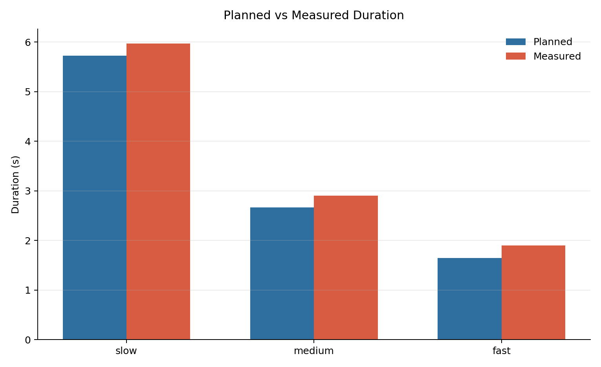
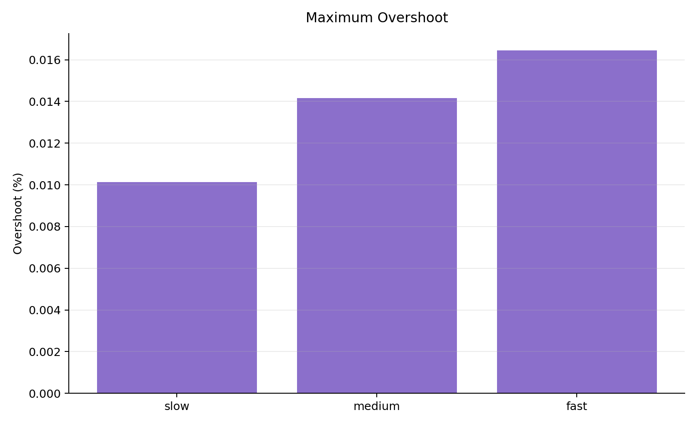
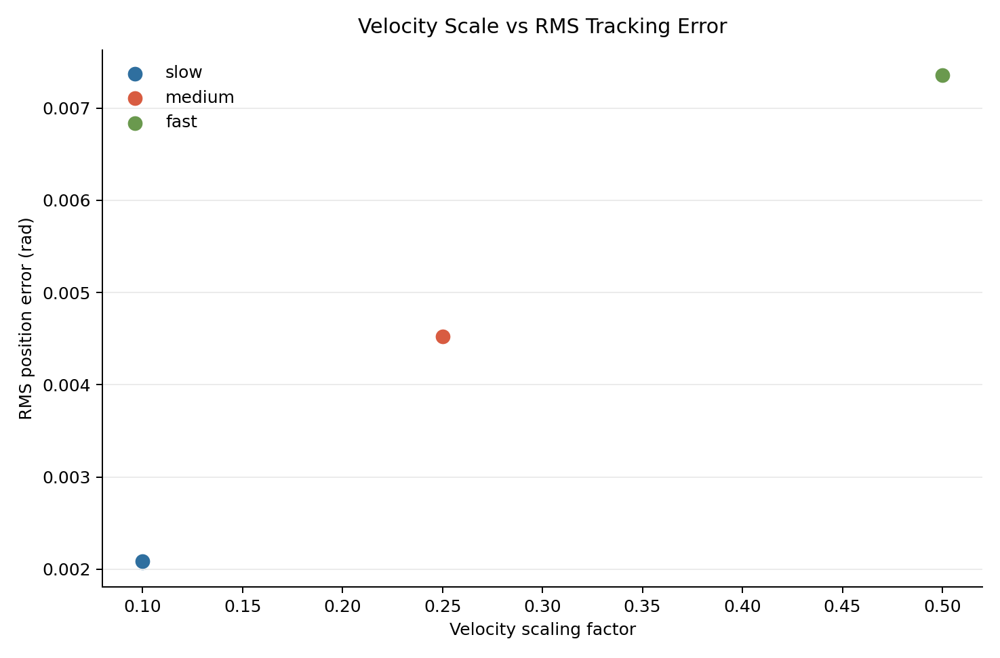

# Position Trajectory Controller Benchmark Results

Generated on 2026-07-08 from `benchmark_control_strategies.launch.py`.

Configuration:

- Controller: `joint_trajectory_controller` with position command interface.
- Strategies: `slow`, `medium`, `fast`.
- Trials: 3 per strategy.
- Total control records: 9.
- Settling tolerance: 0.01 rad.
- Response threshold: 90% of final joint-space motion.

## Files

- `control_strategy_benchmark.csv`: raw per-trial execution records.
- `control_strategy_summary.csv`: strategy-level statistics.
- `control_duration.png`: planned versus measured execution duration.
- `control_tracking_error.png`: RMS, maximum, and steady-state tracking error.
- `control_rms_error.png`: compatibility copy of the tracking-error plot.
- `control_response_time.png`: 90% response time and settling time.
- `control_overshoot.png`: maximum overshoot percentage.
- `control_speed_error_tradeoff.png`: velocity scale versus RMS tracking error.

## Metrics

- `rms_error`: root-mean-square joint position tracking error over the trial.
- `max_abs_error`: maximum absolute joint tracking error during the trial.
- `final_abs_error`: maximum absolute joint error in the final controller sample.
- `steady_state_max_error`: maximum final error between actual and final desired joint positions.
- `steady_state_mean_error`: mean final error across the six joints.
- `max_overshoot`: largest overshoot in radians relative to the final target direction.
- `max_overshoot_percent`: largest overshoot normalized by joint motion.
- `response_time_90`: first time when all moving joints reached 90% of final motion.
- `settling_time`: first time after which all joints stayed within 0.01 rad of final desired position.

## Strategy Summary

| strategy | trials | success_rate | avg_measured_duration | avg_rms_error | avg_max_abs_error | avg_steady_state_max_error | avg_max_overshoot_percent | avg_response_time_90 | avg_settling_time |
| --- | --- | --- | --- | --- | --- | --- | --- | --- | --- |
| slow | 3 | 1.0000 | 5.9667 | 0.002079 | 0.003148 | 0.000028 | 0.0101 | 4.9333 | 5.5667 |
| medium | 3 | 1.0000 | 2.9000 | 0.004521 | 0.007854 | 0.000028 | 0.0142 | 2.2000 | 2.6000 |
| fast | 3 | 1.0000 | 1.9000 | 0.007362 | 0.015755 | 0.000028 | 0.0164 | 1.3000 | 1.5333 |

## Observed Result

- All three strategies completed successfully.
- Faster velocity and acceleration scaling reduced response and settling time.
- Faster execution increased RMS and maximum tracking error.
- Steady-state error stayed very small for all strategies because the active controller is a position trajectory controller.
- Overshoot remained small, below 0.02%, in this simulation setup.

## Figures

