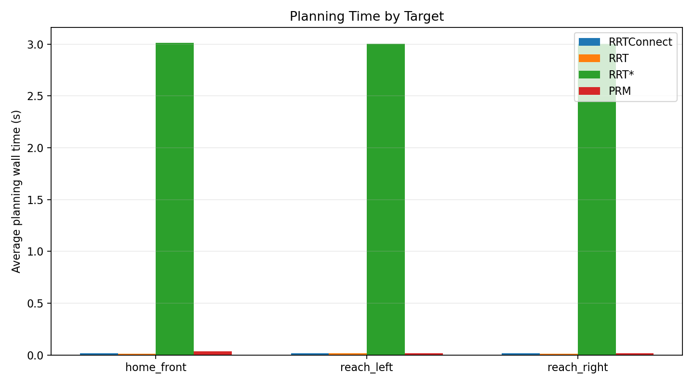

# OMPL Planner Comparison Results

Generated on 2026-07-07 from `benchmark_planners.launch.py`.

Configuration:

- Planners: RRTConnect, RRT, RRT*, PRM
- Targets: `home_front`, `reach_left`, `reach_right`
- Trials: 5 per planner per target
- Total planner records: 60
- Planning time limit: 3.0 s

## Files

- `planner_benchmark.csv`: raw per-trial planner records.
- `planner_summary.csv`: planner-level statistics.
- `planner_target_summary.csv`: planner + target statistics.
- `planner_planning_time.png`: average planning time by planner.
- `planner_path_length.png`: average joint path length by planner.
- `planner_target_planning_time.png`: target-wise planning time comparison.

## Planner Summary

| planner | trials | success_rate | avg_planning_wall_time | avg_planned_duration | avg_trajectory_points | avg_joint_path_length |
| --- | --- | --- | --- | --- | --- | --- |
| RRTConnect | 15.0000 | 1.0000 | 0.017047 | 2.8989 | 30.3333 | 2.7513 |
| RRT | 15.0000 | 1.0000 | 0.015141 | 2.8989 | 30.3333 | 2.7513 |
| RRT* | 15.0000 | 1.0000 | 3.0074 | 2.8988 | 30.3333 | 2.7512 |
| PRM | 15.0000 | 1.0000 | 0.023609 | 2.8989 | 30.3333 | 2.7513 |

## Target Summary

| planner | target | trials | success_rate | avg_planning_wall_time | avg_planned_duration | avg_trajectory_points | avg_joint_path_length |
| --- | --- | --- | --- | --- | --- | --- | --- |
| PRM | home_front | 5.0000 | 1.0000 | 0.036503 | 2.6655 | 28.0000 | 2.6538 |
| PRM | reach_left | 5.0000 | 1.0000 | 0.016651 | 2.8565 | 30.0000 | 2.6556 |
| PRM | reach_right | 5.0000 | 1.0000 | 0.017674 | 3.1747 | 33.0000 | 2.9445 |
| RRTConnect | home_front | 5.0000 | 1.0000 | 0.017661 | 2.6655 | 28.0000 | 2.6538 |
| RRTConnect | reach_left | 5.0000 | 1.0000 | 0.017078 | 2.8565 | 30.0000 | 2.6557 |
| RRTConnect | reach_right | 5.0000 | 1.0000 | 0.016401 | 3.1746 | 33.0000 | 2.9444 |
| RRT | home_front | 5.0000 | 1.0000 | 0.014314 | 2.6655 | 28.0000 | 2.6539 |
| RRT | reach_left | 5.0000 | 1.0000 | 0.015768 | 2.8565 | 30.0000 | 2.6556 |
| RRT | reach_right | 5.0000 | 1.0000 | 0.015342 | 3.1747 | 33.0000 | 2.9444 |
| RRT* | home_front | 5.0000 | 1.0000 | 3.0124 | 2.6654 | 28.0000 | 2.6537 |
| RRT* | reach_left | 5.0000 | 1.0000 | 3.0047 | 2.8564 | 30.0000 | 2.6556 |
| RRT* | reach_right | 5.0000 | 1.0000 | 3.0050 | 3.1747 | 33.0000 | 2.9444 |

## Figures

