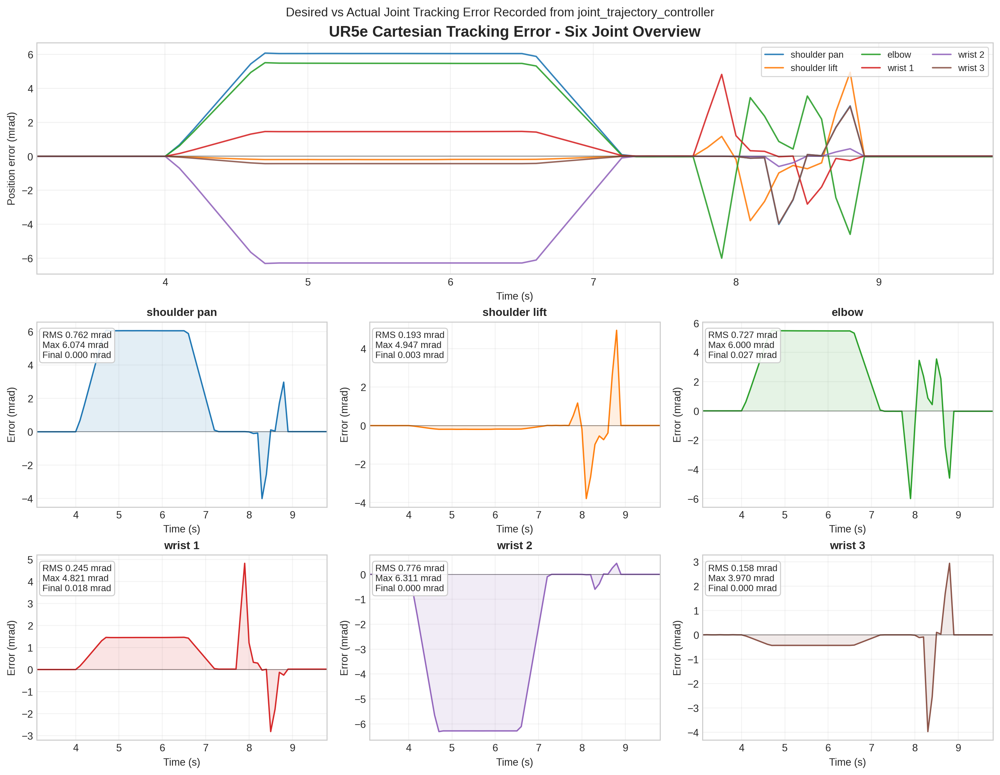
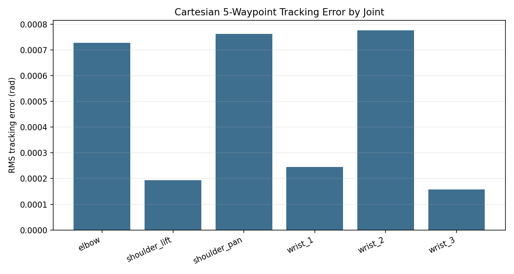

# Cartesian 5-Waypoint Tracking Results

Generated on 2026-07-07 from the Cartesian waypoint demo with `trajectory_recorder`.

The Cartesian demo moved through 5 waypoints. MoveIt reported 100% Cartesian path coverage during the run.

## Files

- `trajectory_log.csv`: raw joint-state and controller-state trajectory log.
- `trajectory_tracking_summary.csv`: per-joint tracking error statistics.
- `tracking_error_focused.png`: focused tracking error curve generated by `plot_trajectory_log.py`.
- `tracking_rms_by_joint.png`: per-joint RMS error bar chart.

## Per-Joint Summary

| joint | samples | rms_error | max_abs_error | final_abs_error |
| --- | --- | --- | --- | --- |
| elbow_joint | 1532.00 | 0.000727 | 0.006000 | 0.000027 |
| shoulder_lift_joint | 1532.00 | 0.000193 | 0.004947 | 0.000003 |
| shoulder_pan_joint | 1532.00 | 0.000762 | 0.006074 | 0.000000 |
| wrist_1_joint | 1532.00 | 0.000245 | 0.004821 | 0.000018 |
| wrist_2_joint | 1532.00 | 0.000776 | 0.006311 | 0.000000 |
| wrist_3_joint | 1532.00 | 0.000158 | 0.003970 | 0.000000 |

## Figures

